

## Overview

- Introduction
- Methodological Issues
- Experiment 1: Testing Frequency Code
- Experiment 2: Testing Effort Code
- Conclusions

--- .segue bg:light gray

# **Introduction**

--- .class #id

## Introduction 

- This study examines the perception of paralinguistic intonational meanings
deriving from Ohala’s Frequency Code (Experiment 1) and Gussenhoven’s
Effort Code (Experiment 2) in British English and Dutch.

- Speakers of British English and Dutch listened to a number of stimuli in their native
language and judged each stimulus on four semantic scales deriving from
these two codes
  - SELF-CONFIDENT versus NOT SELF-CONFIDENT, FRIENDLY versus NOT FRIENDLY (Frequency Code)
 - SURPRISED versus NOT SURPRISED, and EMPHATIC versus NOT EMPHATIC (Effort Code).

---.class #id

## Introduction 

**Paralinguistic cues**: all languages seem
to use gradient variations in pitch properties to signal different degrees of a certain
set of meaning

Gussenhoven (2002) proposed that all paralinguistic uses of pitch stem from **three biologically determined** conditions that cause pitch variation within or across speakers.

---.class #id

## Introduction 
These three conditions and their corresponding interpretations are referred to as the **Frequency Code** (Ohala, 1983, 1984), the **Effort Code**, and the **Production Code** (Gussenhoven, 2002)

Listeners use these codes in speech perception to interpret speech. 

---.class #id

## Introduction
**Frequency Code**

Frequency code was originally proposed by Ohala (1983) to account for cross-language uses of pitch. **There is a relationship between pitch (measured in frequency) and meaning of the speaker**

  - a speaker can signal a “small” meaning by means of a higher pitch and a “big” meaning by means of a lower pitch

- **Informational interpretations:** 
  - “uncertain” (higher pitch): “certain” (lower pitch). 
- **Affective interpretations:**
  - “feminine,” “submissive,” “friendly,” “polite,”  “vulnerable” (higher
pitch)
  - “masculine,” “dominant,” “confident,” “protective,” and “aggressive” for
a lower pitch.

---.class #id

## Introduction
**Effort Code**

When a speaker articulates with great effort, the message is meaningful.

The Effort Code associates wider pitch excursions with meanings that can spring from the speaker’s motivations for the expenditure of articulatory effort. 

- informational interpretations: “emphatic”, “significant”
- Affective interpretations: “surprised”, “agitated.”

---.class #id

## Introduction
**Production Code**

The relevant biological condition for the Production Code is that the generation
of the subglottal air pressure required for the vibration of the vocal cords is associated
with the exhalation phase of the breathing process.

The Production Code associates 
- high pitch with utterance beginnings
- low pitch with utterance endings, continuation of topics. Thus, high beginnings
signal new topics, low beginnings 

A reverse relation holds for utterance endings: “high endings signal continuation, low endings finality and end
of turn” (Gussenhoven, 2002).

---.class #id

## Introduction
**Is use of intonation universal or language specific?**

Evidence has been found for both.

- There seem to be universal cues for emotion, but the degree of the use of the same cues varies (Scherer, 2000; van Bezooijen,1984).

- This idea of a universal being used to varied degrees might be a moving the goalpost 

---.class #id

## Introduction
**Classifying Language Specific Differences**

Theoretically, listeners of any two languages, say Language A and Language
B, can differ in at least three ways in their perception of meanings deriving from the
biological codes.

---.class #id

## Introduction
**Type 1 difference**

Although an increase in pitch is perceived to signal a higher degree of Meaning X by both groups of listeners, the **increase in perceived Meaning X is stronger for listeners from Language B than for listeners from Language A.** 

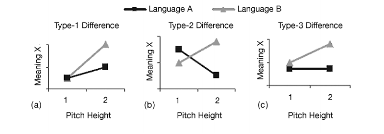

---.class #id

## Introduction
**Type 2 difference**

Inverse relationship - opposite form function mappings cross-lingusitically. 

---.class #id

## Introduction
**Type 3 difference**

An increase in pitch leads to **an increase** in the perceived degree
of Meaning X in **Language B** but **no change in Language A**. As in a Type 2 difference, the two groups of listeners differ in that one group perceives the meaning as
the biological code predicts but the other does not.

---.class #id

## Introduction

**RQ: Do British English and Dutch speakers use the same intonational cues in the perception of meaning changes on a relative scale caused by language specific pitch ranges (a type 1 difference)?**

Figure 2 shows three different potential realizations of type 1 differences. 

Figure 2a: Absolute Scale. 
Speakers project their pitch range in the same way on the semantic scale, such that a pitch value will correspond with identical semantic values in the two languages. 

Figure 2b: Relative Scale
Same semantic range, in spite of their different standard pitch ranges. 

Figure 2c: Use-it-or-lose-it Scale. Narrow-range language Dutch
fails to use the biological codes at all intensively.

---.class #id

## Introduction
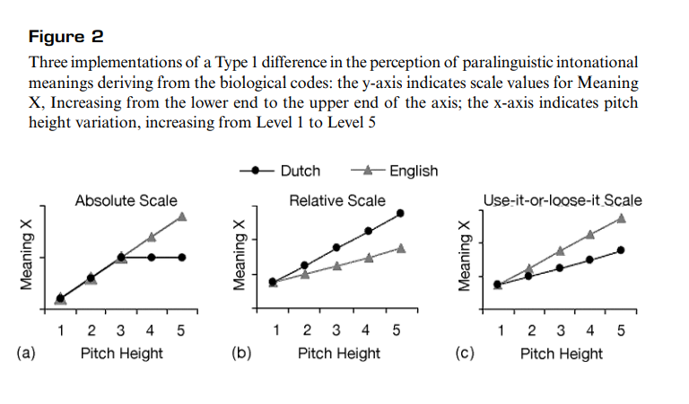.

---.class #id

## Introduction
**Hypotheses**

There will be Type 1 differences with the Relative Scale between groups.
 - The languages will have the same semantic range, and will have the same type of pitch movement (rising or falling), but this will occur within their relative pitch ranges.  

**Hypothesis 1** (the Frequency Code): Dutch listeners perceive a larger difference
in the degree of confidence and friendliness for a given pitch interval than British
English listeners;

**Hypothesis 2** (the Effort Code): Dutch listeners perceive a larger difference in the
degree of surprise and emphasis for a given pitch interval than British English
listeners.

Two cross-linguistic perception experiments, **Experiment 1** and
**Experiment 2**,  tested H1 and H2, and used four semantic scales: SELF-CONFIDENT versus
NOT SELF-CONFIDENT, FRIENDLY versus NOT FRIENDLY (Experiment 1); SURPRISED versus
NOT SURPRISED, and EMPHATIC versus NOT EMPHATIC (Experiment 2).

--- .segue bg:light gray

# **Methodological Issues**

--- .class #id

## 2.1 Pitch range variation

Pitch range can be varied in two ways, span and register (Cruttenden, 1997, p. 47,
p. 123; Ladd, 1996, p. 260). 

- Pitch span reflects the distance between the highs and
the lows of the pitch contour. 

- Pitch register reflects the mean pitch value of the pitch
contour (Rietveld & Vermillion, 2003).

- Pitch register variation may be the primary variable employed in the use of the Frequency Code, as it involves increases or decreases of both the high and low pitches. 

- Effort Code, pitch span will be the main variable. 

--- .class #id

## 2.2 Test tapes

Test tapes were prepared containing experimental stimuli, practice trials (Experiment 2)
and fillers (Experiment 1). 

2 randomized stimulus orders were created.

--- .class #id

## 2.3 Subjects

Age range 18 – 35 years. 

British English subjects were recruited from native speakers of Standard Southern
British English.
  - undergraduates from Cambridge University and the University of London.
- Dutch subjects were recruited from native speakers of Standard Dutch.
  - Polytechnic College of ‘s-Hertogenbosch and the Radboud University Nijmegen.

--- .class #id

## 2.4 Procedure

One session for each semantic scale. 
- The subjects listened to recordings of statements in their native languages that differed in pitch scale and pitch range.

- Subjects recorded their judgments for each stimulus on a Visual
Analog Scale.

- Subjects also filled out a questionnaire on their language and
social background.

--- .class #id

## 2.5 Visual Analog Scale

Two horizontal VASs were used to obtain perceptual judgments. The left end of the VAS was the negative end of each semantic scale.

--- .class #id

## 2.6 Data processing

VAS scores were calculated per semantic attribute by measuring the distance of the slash from the left end in terms of millimetres, from 1 to 99.

--- .segue bg:light gray

# **Experiment 1: Testing Frequency Code**

--- .class #id
## 3.1 Experimental Design

VAS scores were calculated per semantic attribute by measuring the distance of the slash from the left end in terms of millimetres, from 1 to 99.

Three speech acts were taken into account, that is, **Information**, **Request**, and **Instruction**, implemented as four wh-questions, four yes-no questions, and four non-question sentences (3 statements and 1 imperative) respectively.

--- .class #id

## 3.1 Experimental Design

Example:

 *Information:* What’s the LEvel of this course? / Wat is het niVEAU van
 deze cursus?
 
 *Request:* Could you please carry that TAble down the stairs? / Zou je
 de TAfel even naar beneden kunnen dragen?
 
 *Instruction:* You should fill out the CLAIM form. / Je moet het
 declaRAtie formulier invullen.
 

Each source utterance was assigned two contours, %L H*L L% (abbreviated H*L L%)
and %L L*H H% (abbreviated L*H H%). 

--- .class #id

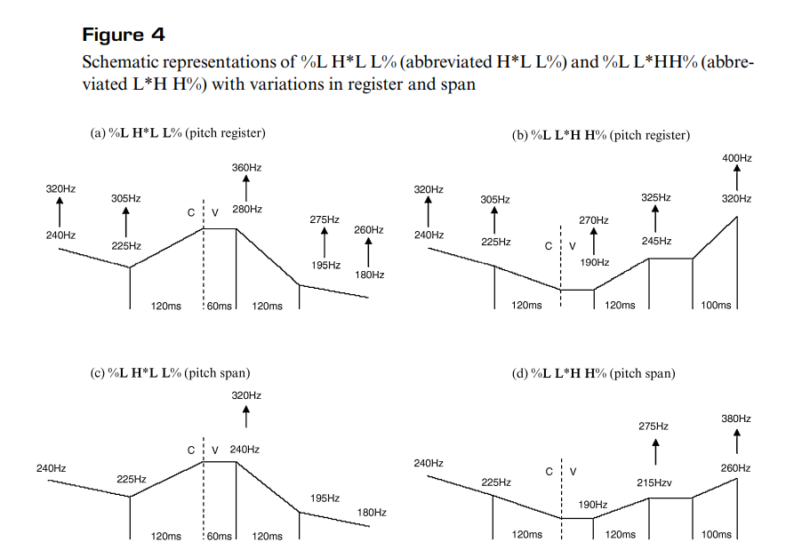

--- .class #id

## 3.2 Procedure

Fifty-three speakers of Dutch (30 women and 23 men) and 29 of British English (20 women and 9 men). 
- written instructions in their to judge each stimulus on how confident the speaker sounded during one session of the experiment, and how friendly the speaker sounded during the other session of the experiment
- recorded their judgments on the VASs. 

--- .class #id

## 3.3 Statistical analyses and results
Two sets of data containing “confidence” scores and “friendliness” scores were obtained
from the two sets of stimuli (span and register)
**4 ANOVAS were carried out**

Dependent variables (confident and friendly with span and register each)
    
One between subject variable: Language (2 levels)

Three within-subject factors, Speech Act (3 levels), Pitch Contour (2 levels), and Pitch Register (5 levels) for the Register data or Pitch Span (5 levels).

--- .class #id

## Results
Main effect of Pitch Register
.

--- .class #id

## Results
Three-way Pitch Register × Speech Act × Language interaction
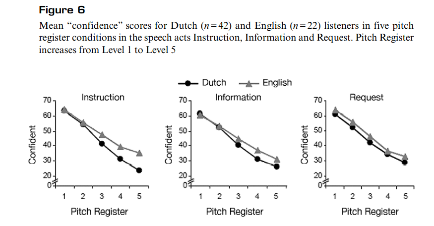

--- .class #id

## Results
Main effect of Pitch Register and Pitch Span. 

--- .class #id

## Results
3 way interaction: Pitch Register × Speech Act × Language

--- .class #id

## 3.4 Discussion
The results were expected in one case, but not in the other. 

Expected: The main effects of Pitch Span and Pitch Register confirm the predictions of the Frequency Code in British English and Dutch: the wider/higher the pitch span/pitch
register, the higher the perceived degree of friendliness and the lower the perceived
degree of confidence.
  
 

--- .class #id

## 3.4 Discussion
Unexpectedly, higher degree of meaning distinction was not made by Dutch speakers on the basis of pitch on the friendly scale.
- - British English and Dutch listeners were similar in the perception of “confident” and “friendly” as signaled by pitch span variation.
- According to the Relative Scale, Dutch listeners should make a sharper meaning distinction between the lowest and the highest pitch registers as a result of their smaller standard pitch range. 

--- .segue bg:light gray

# **Experiment 2: Testing Effort Code**

--- .class #id
## 4.1 Experimental design

Testing the effort code.

In addition to Pitch Register and Peak Height (as an alternative to Pitch Span),
Peak Alignment and End Pitch were included as variables.

Three stimulus sets were designed:
Peak Height-End Pitch (HT) set
Peak Alignment-Peak Height (AH)
Peak Alignment-End Pitch (AT) set.

--- .class #id

## 4.1 Experimental design

**Stimuli** 

Did you ask her for a JOB interview / Heb je haar naar een BAAN gevraagd?
 You asked her for a JOB interview / Je hebt haar naar een BAAN gevraagd.
 

The boundary tone T% was varied between L% and H% in the case of the HT and AT stimulus sets.
It was realized as L% in the AH stimulus set and as H% in the PR stimulus set

--- .class #id

## 4.1 Experimental design

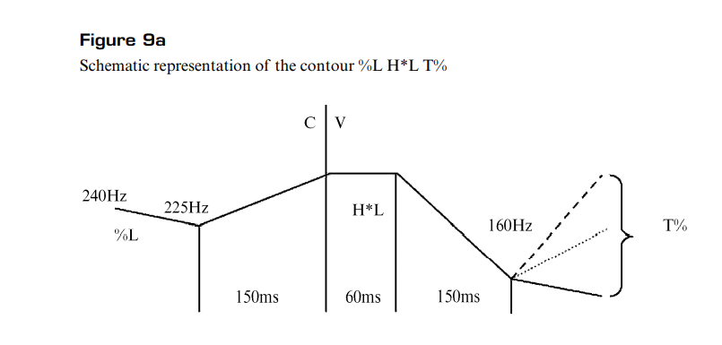

--- .class #id

## 4.1 Experimental design

--- .class #id

## 4.1 Experimental design

--- .class #id

## 4.1 Experimental design

--- .class #id

## 4.1 Experimental design

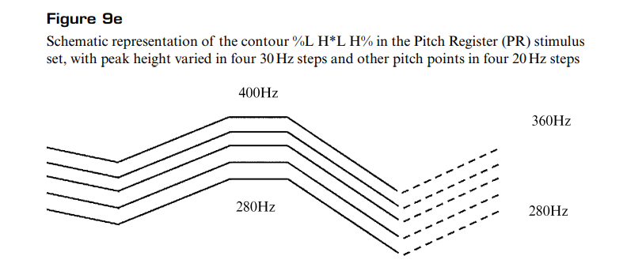

--- .class #id

## 4.2 Procedure

26 speakers of each language participated

Subjects were instructed by means of written instructions

Approximately half of the subjects started with the “emphatic” session and the other half of the subjects started with the “surprised” session.

--- .class #id

## 4.3 Statistical analyses and results

Four sets of data containing “emphasis” scores and “surprise” scores were obtained
from the four sets of stimuli. 

More ANOVAs were done.

--- .class #id

## 4.3 Statistical analyses and results

--- .class #id

## 4.3 Statistical analyses and results

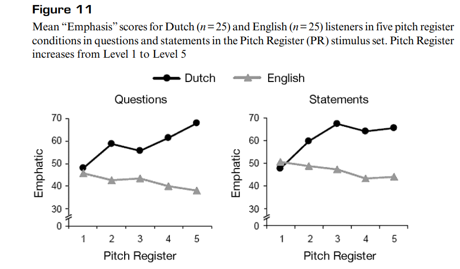

--- .class #id

## 4.3 Statistical analyses and results

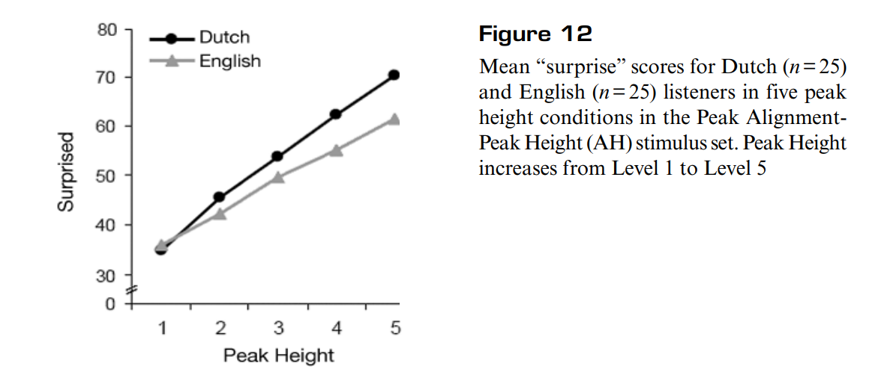

--- .class #id

## 4.3 Statistical analyses and results

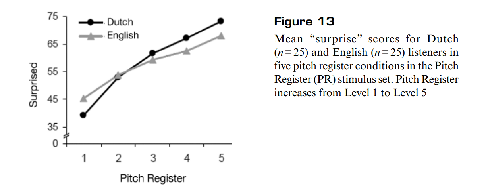

--- .class #id

## 4.5 Language-specific effects of Peak Alignment and End Pitch

--- .class #id
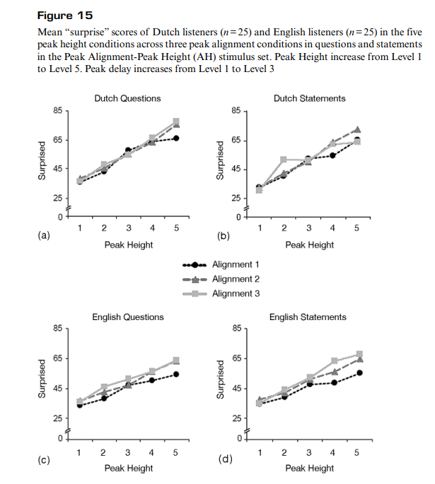.

--- .class #id

## 4.5 Language-specific effects of Peak Alignment and End Pitch

--- .class #id

## 4.5 Language-specific effects of Peak Alignment and End Pitch
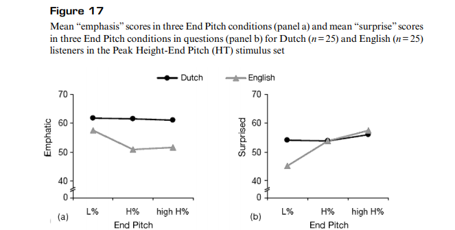

--- .segue bg:light gray

# **Summary and Conclusions**

--- .class #id

## Summary and Conclusions

- Dutch and British English speakers often use the same cues, but to different degrees, to interpret meaning (Type 1 difference)
- Dutch and British English speakers showed some evidence of opposite form function mappings, in which the same cues signaled different meanings. (Type 2 difference)
- Dutch and British English speakers showed some evidence of pitch changes altering meanaing in one language, but not the other. (Type 3 difference)

An important conclusion to be drawn from our investigation is that in spite of
their close genetic relation and similarities in their intonation systems, British English
and Dutch differ significantly in the implementation of the biological codes.

**The presence of a Type 2 difference and Type 3 differences in particular calls the view into question that paralinguistic intonational meaning is universal**

